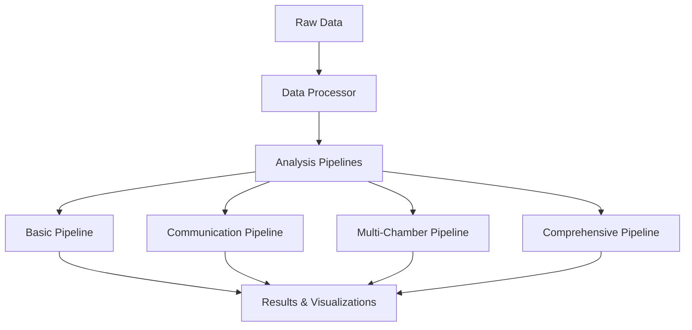

## What is HeartMAP?

HeartMAP (Heart Multi-chamber Analysis Platform) is a production-ready Python package that decodes cellular communication across all four chambers of the human heart. Unlike general single-cell tools, HeartMAP is purpose-built for cardiac biology, offering chamber-specific insights crucial for understanding heart function, disease, and therapeutic opportunities.

<Info>
HeartMAP is published in **Computational and Structural Biotechnology Journal (2025)** and available via `pip install heartmap`
</Info>

## Core Architecture

HeartMAP follows a modular, three-tier architecture designed for flexibility and scalability:



### Architecture Components

<CardGroup cols={3}>
  <Card title="Data Layer" icon="database">
    Quality control, normalization, filtering, and preprocessing of single-cell RNA-seq data
  </Card>
  
  <Card title="Analysis Layer" icon="microscope">
    Four specialized pipelines for different analysis needs - from basic QC to comprehensive analysis
  </Card>
  
  <Card title="Output Layer" icon="chart-line">
    Automated visualizations, reports, and exportable results in multiple formats
  </Card>
</CardGroup>

## Analysis Workflow

HeartMAP processes single-cell heart data through a progressive, tiered workflow:

### Stage 1: Data Processing

```python
from heartmap import Config
from heartmap.data import DataProcessor

config = Config.default()
processor = DataProcessor(config)

# Automatic QC and preprocessing
adata = processor.process_from_raw('heart_data.h5ad')
```

**Processing steps:**
- Cell and gene filtering (min_genes=200, min_cells=3)
- Normalization to target_sum=10,000
- Log transformation
- Highly variable gene selection (n_top_genes=2000)
- PCA dimensionality reduction (n_components=50)
- Neighborhood graph construction

### Stage 2: Analysis Pipeline Selection

Choose the pipeline that matches your research question:

<AccordionGroup>
  <Accordion title="Basic Pipeline" icon="1">
    **Best for:** Initial exploration and cell type identification
    
    - Quality control metrics
    - Cell clustering (Leiden algorithm)
    - Basic cell type annotation
    - UMAP visualizations
    - Runtime: 5-10 minutes
  </Accordion>

  <Accordion title="Communication Pipeline" icon="2">
    **Best for:** Cell-cell interaction analysis
    
    - Ligand-receptor interaction analysis
    - Communication hub identification
    - Pathway enrichment
    - Network topology analysis
    - Runtime: 10-15 minutes
  </Accordion>

  <Accordion title="Multi-Chamber Pipeline" icon="3">
    **Best for:** Chamber-specific analysis
    
    - Chamber-specific marker identification (RA, RV, LA, LV)
    - Cross-chamber correlation analysis
    - Comparative chamber analysis
    - Chamber composition visualization
    - Runtime: 15-20 minutes
  </Accordion>

  <Accordion title="Comprehensive Pipeline" icon="4">
    **Best for:** Complete analysis with all features
    
    - All features from Basic, Communication, and Multi-Chamber
    - Integrated comprehensive dashboard
    - Automated HTML reports
    - Complete result persistence
    - Runtime: 20-30 minutes
  </Accordion>
</AccordionGroup>

### Stage 3: Results and Interpretation

HeartMAP generates structured outputs:

```
results/
├── figures/                    # Publication-ready plots
│   ├── umap_clusters.png
│   ├── communication_heatmap.png
│   ├── chamber_composition.png
│   └── hub_scores.png
├── data/
│   ├── annotated_data.h5ad    # Processed AnnData
│   └── results.json           # Structured results
└── reports/
    └── comprehensive_report.html
```

## Key Concepts

### Chamber-Specific Analysis

HeartMAP treats each heart chamber as a distinct microenvironment:

- **RA (Right Atrium):** 28.4% of cells, NPPA, MYL7 markers
- **RV (Right Ventricle):** 18.2% of cells, NEAT1, MYH7 markers
- **LA (Left Atrium):** 26.4% of cells, NPPA, ELN, RORA markers
- **LV (Left Ventricle):** 27.0% of cells, CD36, FHL2, MYH7 markers

<Note>
Cross-chamber correlations reveal functional relationships:
- **RV vs LV:** r = 0.985 (highest similarity)
- **RA vs LA:** r = 0.960
- **LA vs LV:** r = 0.870 (lowest similarity, reflecting specialization)
</Note>

### Cell-Cell Communication

HeartMAP uses ligand-receptor (L-R) interaction analysis to infer cellular communication:

1. **L-R Database:** 100+ curated cardiac-relevant pairs (LIANA, CellPhoneDB, custom)
2. **Expression Analysis:** Co-expression of ligand (sender) and receptor (receiver)
3. **Communication Scoring:** Geometric mean of ligand-receptor expression
4. **Hub Detection:** Cells with high connectivity in communication networks

### Memory Optimization

HeartMAP is designed to work on consumer hardware:

| System RAM | max_cells_subset | max_genes_subset | Use Case |
|------------|------------------|------------------|----------|
| 8GB | 10,000 | 2,000 | Laptop/Desktop |
| 16GB | 30,000 | 4,000 | Workstation |
| 32GB | 50,000 | 5,000 | Server |
| 64GB+ | 100,000+ | 10,000+ | HPC/Cloud |

## Design Principles

<CardGroup cols={2}>
  <Card title="Reproducibility" icon="rotate">
    Fixed random seeds (seed=42) ensure identical results across runs
  </Card>
  
  <Card title="Modularity" icon="cubes">
    Mix and match pipelines and components for custom workflows
  </Card>
  
  <Card title="Configurability" icon="sliders">
    YAML-based configuration for easy customization without code changes
  </Card>
  
  <Card title="Production-Ready" icon="check">
    Comprehensive testing, error handling, and documentation
  </Card>
</CardGroup>

## Quick Start Example

```python
from heartmap import Config
from heartmap.pipelines import ComprehensivePipeline

# Load default configuration
config = Config.default()

# Optimize for your system memory
config.data.max_cells_subset = 30000
config.data.max_genes_subset = 4000

# Run comprehensive analysis
pipeline = ComprehensivePipeline(config)
results = pipeline.run('heart_data.h5ad', 'results/')

print(f"Analysis complete!")
print(f"Identified {len(results['adata'].obs['leiden'].unique())} cell clusters")
print(f"Results saved to results/ directory")
```

## Next Steps

<CardGroup cols={2}>
  <Card title="Pipelines" icon="pipe" href="/concepts/pipelines">
    Learn about each pipeline and when to use them
  </Card>
  
  <Card title="Chamber Analysis" icon="heart" href="/concepts/chamber-analysis">
    Understand chamber-specific analysis features
  </Card>
  
  <Card title="Cell Communication" icon="network-wired" href="/concepts/cell-communication">
    Explore ligand-receptor analysis methods
  </Card>
  
  <Card title="Configuration" icon="gear" href="/concepts/configuration">
    Customize HeartMAP for your needs
  </Card>
</CardGroup>

## Scientific Impact

<Tip>
**Published Research:** HeartMAP analyzed 287,269 cells from 7 healthy human heart donors, revealing:
- 150+ chamber-specific markers per chamber pair
- Communication hub scores (0.037-0.047 for key cell types)
- Chamber-specific therapeutic targets for precision cardiology
</Tip>

## References

Kgabeng, T., Wang, L., Ngwangwa, H., & Pandelani, T. (2025). HeartMAP: A Multi-Chamber Spatial Framework for Cardiac Cell-Cell Communication. *Computational and Structural Biotechnology Journal*. [https://doi.org/10.1016/j.csbj.2025.11.015](https://doi.org/10.1016/j.csbj.2025.11.015)